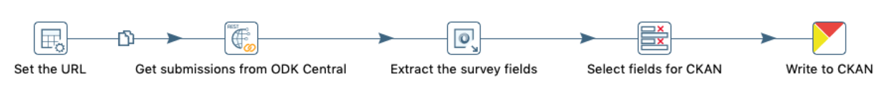
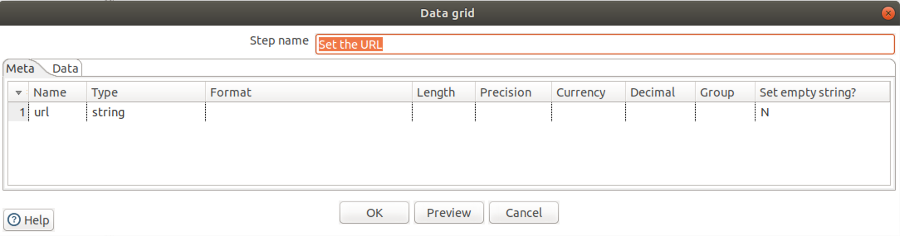
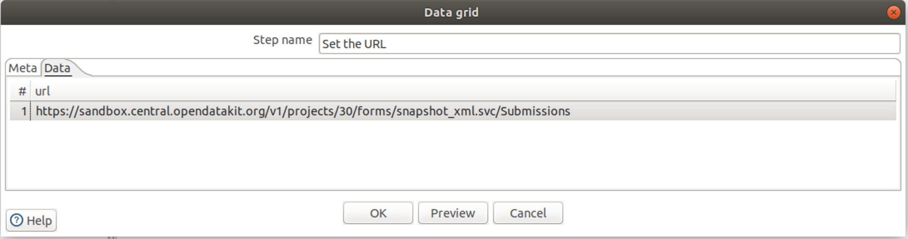
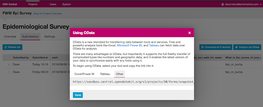
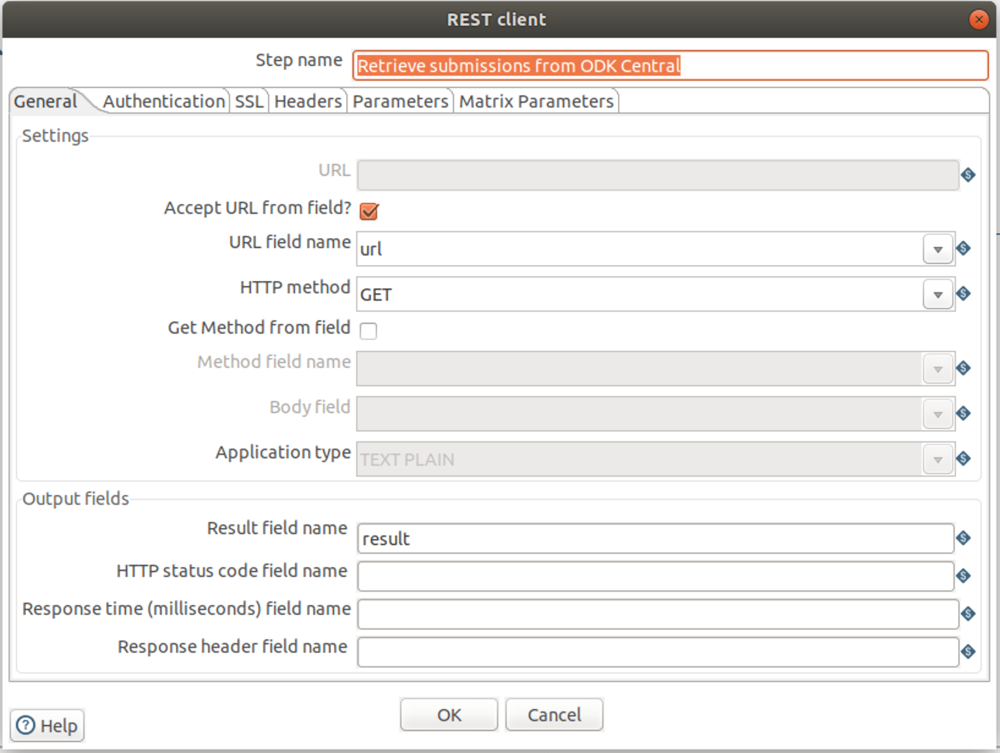
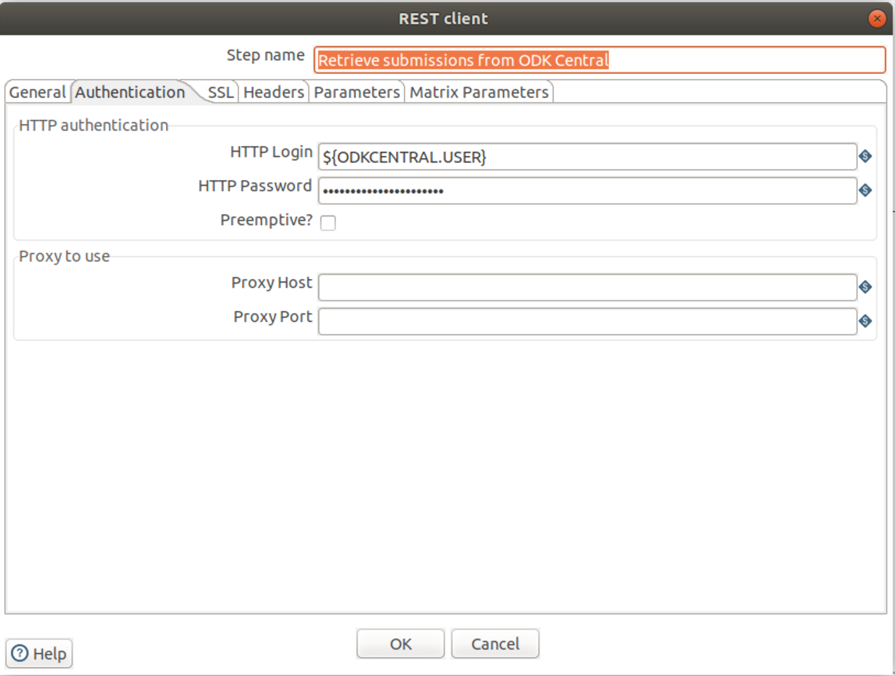
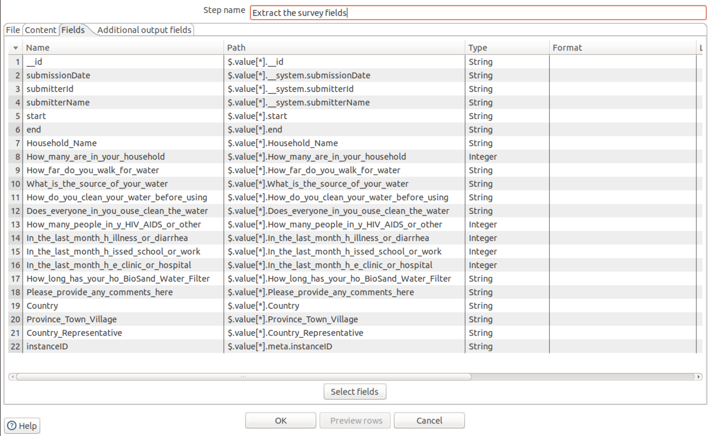
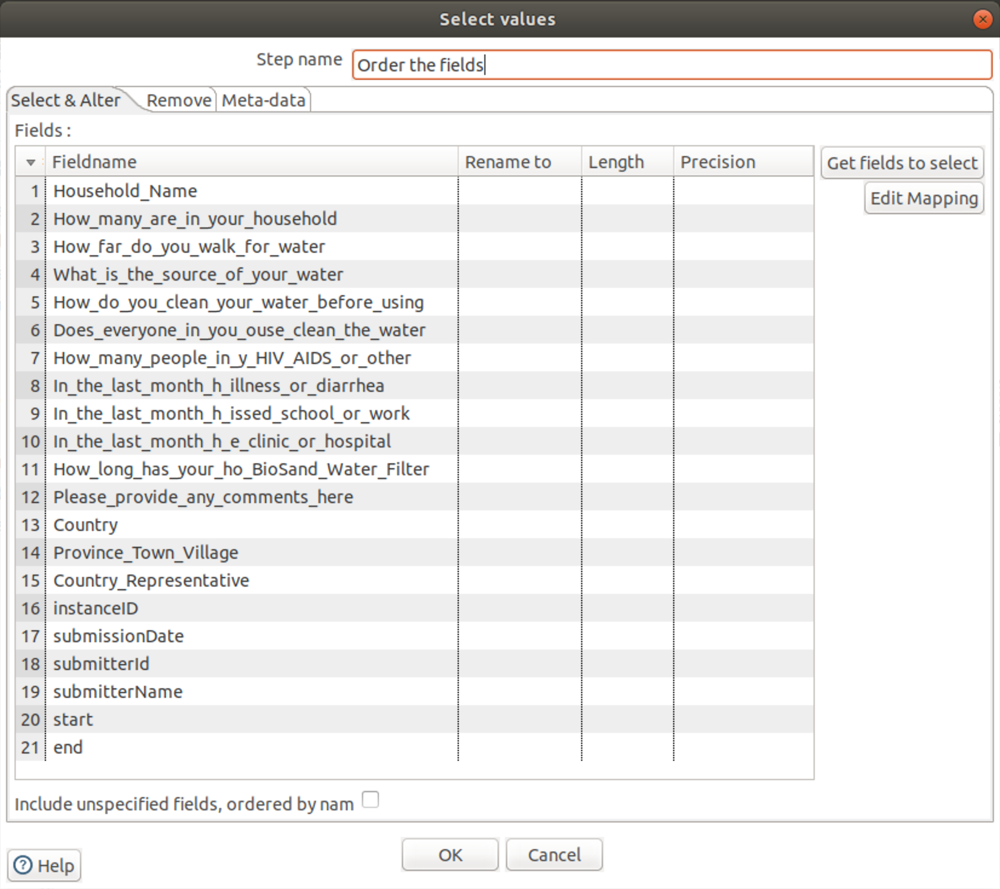
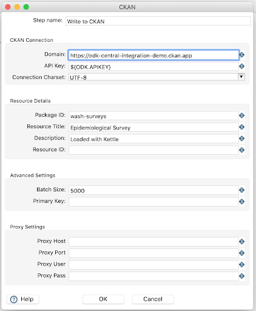
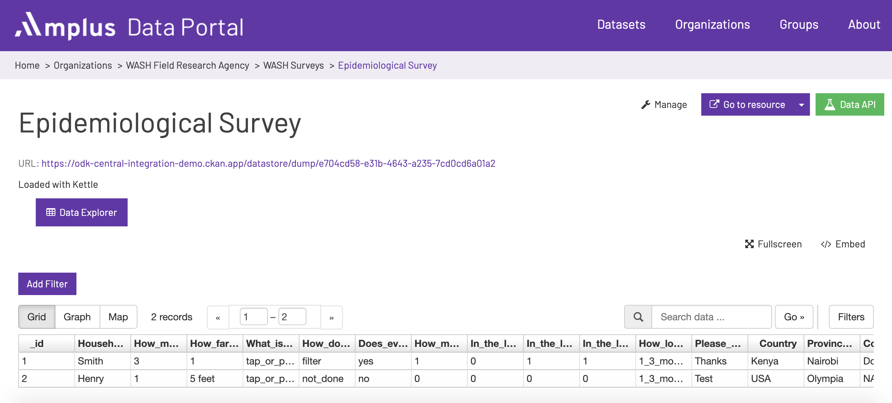

# Automating Data Delivery using the OData Endpoint in ODK

## Overview

[ODK Central](https://docs.opendatakit.org/central-intro/)
includes an [OData](https://www.odata.org/) endpoint that
can be accessed by tools and languages that support RESTful web
services. OData has been shown to work with Tableau and PowerBI,
allowing users to download survey submissions for immediate analysis.
But what about other scenarios? A common requirement is to retrieve ODK
submissions, extract the survey data and load it into a data portal or
a relational database. ODK Central supports this use case as
well.

The purpose of this article is to show how survey data can be 
processed using an open source data integration tool (Kettle).
We retrieve submissions from a survey hosted on the [ODK Central sandbox
server](https://sandbox.central.opendatakit.org/#/), transform the JSON document 
into tabular rows, then load the rows into a dataset stored in a CKAN data portal. 
The workflow is implemented using a small number of Kettle steps and can be freely
modified by anyone in the ODK Community. Additional scenarios are discussed
and links to documentation are provided at the end.

## About Kettle

[Kettle](http://www.ibridge.be/) is an open source tool
for extracting, transforming and loading data. The design paradigm is
based on the concept of components (*steps*) that are connected to form
a data pipeline (aka a *directed graph*). Data flows from component to
component as defined in the graph; this fulfils the logic of the
transformation. Each component implements a specific type of
functionality such as calling a web service, performing a lookup,
calculating values or writing to a file or database table. With a
library of over 100 built-in steps, Kettle is capable of handling
sophisticated scenarios.

The Kettle engine runs as an embedded service within a graphical
designer (*Spoon*). To simplify configuration management and to enforce
security, the designer can be deployed as a web application (*WebSpoon*).
Kettle also runs as a headless process on a server to support
production deployments in a cloud environment. A companion service
implements job orchestration. This allows a set of transformations to be
executed with full dependency checking and error handling.

## About CKAN

[CKAN](https://ckan.org/) is a tool for creating open
data websites. Think of it as a content management system (like
WordPress) but for data rather than web pages and blog posts. It allows
organizations to manage and publish collections of structured data. CKAN
is particularly useful when data needs to be shared by a group of
organizations. It is used by a significant number of national and local
governments, research institutions, and other organizations, e.g.
Nigeria\'s [GRID3](http://grid3.org/) data portal and the
[Humanitarian Data Exchange](https://data.humdata.org/)
(HDX), and [many
others](https://ckan.org/about/instances/).

Once data has been published, site visitors can use it\'s search features to
browse and download the data they need. They can also preview it using
maps, graphs and data views. CKAN stores metadata about *datasets* and
*resources*, and also offers a powerful API that allows third-party applications 
and services to interact with it.

Like Kettle, CKAN is open source software with an active developer
community that has contributed more than 200 plugins. You can test drive
\"vanilla\" CKAN using the [online
demo](https://demo.ckan.org/) instance. This solution uses
a CKAN instance hosted at
[Amplus.io](https://amplusdata.io/).

## Workflow

*Figure 1* illustrates how our use case appears in Kettle. One benefit is
immediately clear -- the transformation logic is easy to understand.
Only five steps are required to download the submissions from ODK
Central, to parse them and to load them into CKAN. As indicated by the
arrows, the data flows from left to right. Let's look at each of these
steps in more detail.

*Figure 1*

### Set the URL

The transformation starts with a *Data Grid* step. This step is used
anywhere we want to generate arbitrary rows of data. For example, it can
be used to create reference lists such as a custom calendars or lookup
tables. In our case we use it to define the value of the ODK Central
sandbox's OData endpoint URL. Under the *Meta* tab we see that a field
called *url* is being created (*Figure 2a*). 

*Figure 2a*
>
Under the *Data* tab we assign the ODK Central endpoint to the *url* field (*Figure 2b*). This value will get passed as an *output field* to the downstream step which
will treat it as input.

*Figure 2b*

How did we determine which URL to use? ODK Central makes this easy.
Under the *Submissions* tab of any survey you'll see the option to
*Analyze via OData*. Simply click on this button to display the URL. 
(*Figure 2c*):

*Figure 2c*

### Get Submissions from ODK Central

To retrieve our survey data from the OData endpoint, we use a Kettle
step called the *REST Client*. This step is not specific to ODK -- it
can be used with any well-formed REST endpoint. In our case we make a
single call to the endpoint and it returns a JSON document containing
the survey collection. The connection to ODK Central is a simple "fill
in the blanks" exercise. In *Figure 3a*, we see that the OData endpoint
URL is defined in the field *url* (passed to us by the upstream step)
and that the HTTP method is GET. The JSON document returned by the OData
REST call is stored in a field called *result*.

*Figure 3a*

We need to provide credentials to ODK Central. ODK Central supports
basic authentication, so we provide values for the *HTTP Login* and
*HTTP Password* parameters (*Figure 3b*).

*Figure 3b*

Note the use of a variable called `${ODKCENTRAL.USER}`. Kettle allows
administrators to define variables that are resolved at
runtime. This enables lifecycle testing, simplifies
maintenance and improves security.

### Extract the Survey Fields

Once the transformation has executed the OData endpoint call, the
*result* field contains our survey collection. The *JSON Input* step
allows us to specify the key/value pairs in the *result* document that
correspond to the survey questions, and to map the values to new fields
that appear in the output stream (*Figure 4*). Kettle supports [JSONPath](https://goessner.net/articles/JsonPath/)
expressions to allow for precise extraction of fields within the
submissions document's structure.

*Figure 4*

### Select Fields for CKAN

It's not uncommon to want "friendly names\" for use in reports and
analyses. It may also be necessary to translate survey labels to a
different language. We can use the *Select Values* step to accomplish
this and to re-order or remove columns as needed (*Figure 5*).

*Figure 5*

### Write to CKAN

We're now ready to write the survey answer records to CKAN. Unlike our
use of the general-purpose *REST Client* step with the OData endpoint,
the *CKAN Writer* step is specific to CKAN (*Figure 6a*). It\'s a
purpose-built step that interacts with the data portal using the CKAN
API. Special-purpose steps are useful when a data source has unique
characteristics. For example, CKAN is based on the concept of *datasets*
that contain *resources* and also uses an API key for authentication.
The Kettle step library can be extended with community-developed
plug-ins; the CKAN Writer step is a good example.

*Figure 6a*

Once we've executed the transformation we can preview the survey
answers in the CKAN portal (*Figure 6b*), proving that the data delivery
process was automated end-to-end. With sufficient data it is also
possible to use CKAN\'s available
[visualizations](https://docs.ckan.org/en/2.8/maintaining/data-viewer.html).

*Figure 6b*

## Additional Scenarios

We chose a simple use case to illustrate how a small subset of Kettle
steps could be used to implement basic workflow. In the real world
we\'re likely to encounter additional requirements:

-   **Loading to relational databases**. In our example,
    loading to MySQL, PostgreSQL, SQL Server or another JDBC-compatible
    database would be as simple as replacing the *CKAN Writer* step with
    a *Table Output* step. It\'s even possible to write to multiple
    output destinations simultaneously.

-   **Multi-value surveys (i.e. with questions that result in a
    variable-length array of answers)**. This is a common
    scenario which Kettle can support by \"cascading\" JSON Input steps
    in a transformation. Multi-value fields are extracted in the first
    step (as JSON "sub-documents"), then parsed in a second
    step.

-   **Merging submissions from related-but-different
    surveys**. Surveys evolve over time and there is often a
    requirement harmonize semantically equivalent data. Since Kettle can
    dynamically create and alter fields, it's possible to merge data
    from multiple versions of a survey. Default and/or calculated values
    can be used with missing answers.

-   **Capturing and recording metadata**. Metadata is
    available directly in the submissions document, in the XLSForm and
    also in the runtime environment. Kettle can read, extract and
    correlate metadata from multiple sources to create detailed logs for
    the purpose of documentation and governance.

-   **Enrichment with existing data**. Surveys often make use of
    drop-down lists to ensure consistent data quality. With a known set
    of values it\'s possible (using one or more key fields) to perform
    lookups against a database table or web service. More descriptive
    and/or additional values can be appended to produce an enriched data
    product.

-   **Dynamically-generated XLSForms**. Kettle\'s *Excel
    Writer* step provides an opportunity to generate XLSForms using data
    available at any point in a pipeline. The step can create new
    spreadsheets (with the option to use a template) and can update
    existing spreadsheets.

-   **ODK-X**. Although ODK-X does not support OData, it does
    have a REST API that allows a developer to retrieve survey results.
    Unlike ODK v1, ODK-X can return surveys submitted since a specific
    date, or surveys whose data values have changed . See 
   [https://docs.opendatakit.org/odk-x/odk-2-sync-protocol](https://docs.opendatakit.org/odk-x/odk-2-sync-protocol/)
    for details.

## Summary

This example has shown that it\'s possible to retrieve submissions from
ODK Central, extract fields from survey collections and load them as
rows into CKAN. *The solution stands out for its simplicity* - anyone
who can install a Java application on Windows, Linux or MacOS can
execute the workflow with minimal difficulty. With a modest orientation
it\'s possible for data-savvy analysts to adapt and extend the
transformation for additional use cases. Organizations with budget constraints
\- and consortiums with the need to standardize on an open source stack -
can use Kettle with ODK Central to standardize post-survey processing
and to improve interoperability.

## Try It Yourself

Kettle (including the CKAN Datastore Writer Plugin) can be downloaded
at
[http://kettle-builds.s3-website-eu-west-1.amazonaws.com/kettle-remix/](http://kettle-builds.s3-website-eu-west-1.amazonaws.com/kettle-remix/).
This solution was developed and tested using Kettle
8.2.0.7-719 on Ubuntu 18.04 LTS.

CKAN can be downloaded at
[https://ckan.org/download-and-install/](https://ckan.org/download-and-install/)

A simple transformation for testing Kettle connectivity to CKAN can be found [here](./create-simple-resource-in-ckan.ktr).

## CKAN Datastore Writer Plugin \-- Attribution

*Initial Release:*

-   Caio Moreno de Souza:
    > [https://github.com/caiomsouza/CKAN-DataStore-Writer-for-Pentaho-Data-Integration](https://github.com/caiomsouza/CKAN-DataStore-Writer-for-Pentaho-Data-Integration)

*Enhancements:*

-   OpenGov:
    > [https://github.com/OpenGov-OpenData/CKAN-DataStore-Writer-for-Pentaho-Data-Integration](https://github.com/OpenGov-OpenData/CKAN-DataStore-Writer-for-Pentaho-Data-Integration)

-   KnowBI (the version used by this solution):
    > [https://github.com/knowbi/knowbi-kettle-ckan-step](https://github.com/knowbi/knowbi-kettle-ckan-step)

## Kettle Documentation

> Community Documentation [(Kettle REMIX Manual)](https://docs.google.com/document/d/171hZhZcErit6HeU6oag4Jh5ghM-EQnsTHBS2ChieL9g/edit)

> [Pentaho Kettle Solutions: Building Open Source ETL Solutions with
> Pentaho Data Integration](https://www.amazon.com/Pentaho-Kettle-Solutions-Building-Integration/dp/0470635177/)
 by Matt
> Casters, Roland Bouman and Jos Van Dongen
>
> [Pentaho Data Integration Quick Start Guide: Create ETL processes
> using Pentaho](https://www.amazon.com/Pentaho-Integration-Quick-Start-Guide/dp/1789343321)
by Maria Carina Roldan